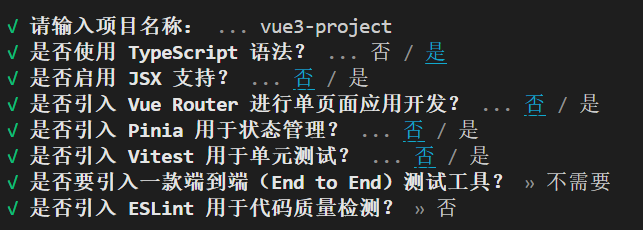

# vue3-studyProject
vue3+ts学习视频跟练笔记

由于本地为vue2环境（node版本为16）
需先更新node
- 到nodejs官网下载最新版本v22.12
根据vue3官方文档命令创建vue3项目`npm create vue@latest`
- 其实项目名称最好是纯小写字母、数字、下划线
  - Ok to proceed? (y) y
  - 
  - `cd vue3-project` 进入新创建的项目
    - 进入后就可以输入以下指令了`npm install`、`npm run dev`

## 进入项目后 short into
简单介绍下除了src的文件
1. .vscode里的extensions.json里放的是安装推荐插件（不重要 为了顺序才写的这条
2. index.html是项目的入口文件，里面的/src/main.ts支持着整个应用跑起来。不同于vue2的main.js的项目入口文件
3. env.d.ts是让ts能识别txt等文件类型，如果没有npm i的话，进入这个文件会报错
4. package-lock.json和package.json 略过
5. tsconfig.app.json、tsconfig.json、tsconfig.node.json -- ts的三个配置文件 别删就行
6. vite.config.ts是整个工程的配置文件：安装插件、配置代理等